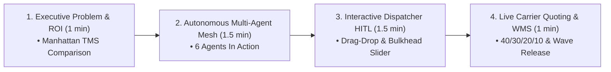

# Executive MVP Presentation & Demo Walkthrough Guide
## Autonomous Multi-Agent Cold-Chain Route & Carrier Engine

Use this 5-minute structured presentation script and click-through guide to demonstrate the MVP to executives tomorrow.

---

## ⏱️ 5-Minute Executive Pitch Script & Demo Flow



---

### Step 1: The Executive Hook & Legacy TMS Comparison (1 Minute)

#### 🎯 What to Say:
> *"Today, wholesale grocery distribution relies on legacy batch systems like Manhattan TMS or Manugistics. These systems plan static, single-temp routes overnight, partition trailers with rigid partitions, and use stale contracted freight rate tables.*
> 
> *Our **Autonomous Multi-Agent Engine** replaces static batch runs with a continuous, sub-second multi-agent mesh that dynamically optimizes multi-temperature compartments (Frozen, Chill, Ambient), adjusts trailer bulkheads in 2-pallet increments, and runs live carrier rate auctions scored on a 40/30/20/10 multi-criteria scorecard."*

#### 🖱️ What to Click:
1. Open [`mvp_cockpit.html`](file:///Users/pgoyal/Documents/GitHubN/agentic-route-optimization/mvp_cockpit.html) in your browser.
2. Click the top button: **"Compare vs Manhattan TMS"**.
3. Point to the **Hard ROI Metrics**:
   - **+14.7% Cube Utilization** ($78.5\% \rightarrow 93.2\%$).
   - **-25.6% Fleet Miles & Fuel** ($248\text{ mi} \rightarrow 184.5\text{ mi}$).
   - **$18,400 Weekly Savings** ($-\$956,800/\text{year}$ across a 50-truck fleet).
   - **Sub-300ms** real-time recalculation vs 45+ minute legacy overnight batch runs.

---

### Step 2: Demonstrating the 6 Autonomous AI Agents (1.5 Minutes)

#### 🎯 What to Say:
> *"The backbone of this engine is a collaborative swarm of 6 specialized autonomous AI agents, each handling a critical logistics domain without manual intervention."*

#### 🖱️ What to Click:
1. Click **"Re-Run AI Swarm"** at the top right.
2. Direct executive attention to the **Multi-Agent Thought & Collaboration Stream** (the live terminal feed on the top left):
   - **Agent 1 (Demand Profiler)**: Shows 4D vector ingestion ($118$ pallets, $137.3\text{k lbs}$, Frozen/Chill/Ambient partitioning).
   - **Agent 2 (Fleet Allocator)**: Allocates 53W, 48W, and 46W city reefers with liftgates.
   - **Agent 3 (Route Optimizer)**: Solves MC-VRPTW soft time windows and configures movable bulkheads.
   - **Agent 4 (Rate Aggregator)**: Broadcasts parallel RFQs to carrier networks in $<280\text{ms}$.
   - **Agent 5 (Carrier Decision)**: Calculates 40/30/20/10 composite score and triggers WMS Wave release.
   - **Agent 6 (IoT Telematics Monitor)**: Verifies 100% FSMA cold-chain compliance across all thermistors.
3. Click **"Inspect 6 Agents"** to show executives the transparent System Prompts, Active Tools, and Decision Artifacts.

---

### Step 3: Interactive Dispatcher HITL — Drag-and-Drop & Dynamic AI Plan Comparison (1.5 Minutes)

#### 🎯 What to Say:
> *"Unlike black-box systems, our engine gives dispatchers full Human-in-the-Loop (HITL) control with instant, sub-50ms constraint validation and transparent financial feedback."*

#### 🖱️ What to Click:
1. **Interactive Stop Drag-and-Drop & Real-Time Cost Recalculation**:
   - In the **Stop Sequencer** list on the left, drag any stop (e.g. *ShopRite of Hoboken*) from **Route-101** to **Route-102**.
   - Show executives the **Plan Comparison Banner** (`⚠️ DISPATCHER OVERRIDE PLAN ACTIVE`):
     - Notice the live $\Delta\text{mi}$ ($+12.4\text{ mi}$), $\Delta\text{time}$ ($+35\text{ mins}$), and $\Delta\text{cost}$ ($+\$80.60$), plus any window violations.
     - The map polylines and stop numbers update instantly.
   - Click the **"↩️ Revert to AI Recommended Plan"** button to snap back to the mathematically optimal baseline.
2. **2D Movable Bulkhead Visualizer**:
   - Switch to the **"2D Bulkhead & Staging"** tab in the main workspace.
   - Move the **Frozen Compartment Slider** from 12 to 14 pallets.
   - Show how the trailer pallet layout dynamically shifts colors (❄️ Blue Frozen, 🥦 Green Chill, 🥫 Yellow Ambient) while verifying **LIFO (Last-In First-Out) reverse-drop staging** to eliminate warehouse restaging.

---

### Step 4: Dedicated Live Carrier Auction & 40/30/20/10 Scorecard (1 Minute)

#### 🎯 What to Say:
> *"Once routes are finalized, dispatchers can switch to the dedicated **Carrier Rate Auction & MCDA** tab. The system doesn't rely on static rate sheets—it broadcasts parallel RFQs and scores carriers across 4 strategic pillars: 40% Rate, 30% Historical Reliability, 20% Cold-Chain Temp SLA, and 10% Preferred Partner Status."*

#### 🖱️ What to Click:
1. Click the **"Live Carrier Rate Auction & MCDA"** tab in the main workspace.
2. Direct attention to the **Executive Summary Header** & **2x2 Carrier Grid Cards**:
   - Show why **Swift Cold-Chain Logistics** won the tender:
     - Even though the unvetted Spot Carrier quoted a cheaper raw price ($320 vs $366.60), the spot carrier is flagged **"RISK REJECT"** because it lacks dual-zone multi-temp capabilities, risking food spoilage.
     - Swift scored highest ($89.8/100$) with $98.3\%$ on-time SLA and certified FSMA IoT telematics.
3. Show the **MCDA Scoring Matrix Table** beneath the cards for full transparent auditability.
4. Point out the green status badge: **"EDI 204 Transmitted • Wave Released (Bay 04)"** — showing seamless WMS execution.
5. Click **"Override & Book Carrier"** on Prime Inc to demonstrate instant tender reassignment.

---

## 💻 Technical Demonstration (Terminal / CLI)

If executives or technical architects ask to see the Python agent backend code running live:

```bash
cd /Users/pgoyal/Documents/GitHubN/agentic-route-optimization
python3 run_agents.py
```

This will run all 6 Python agents in sequence with colored terminal outputs, timing benchmarks, and JSON payload summaries.
