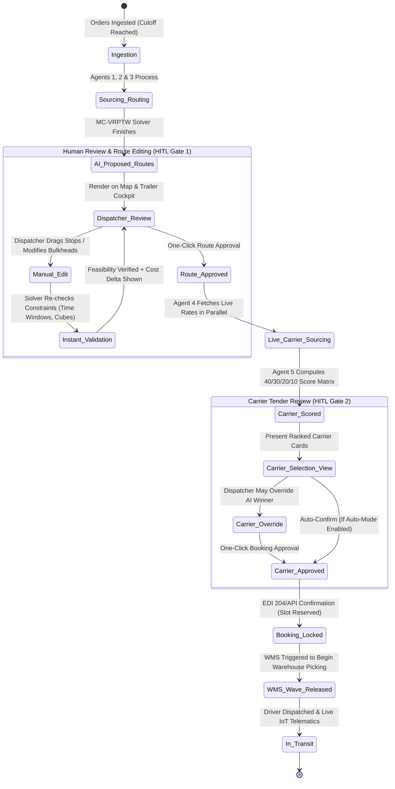
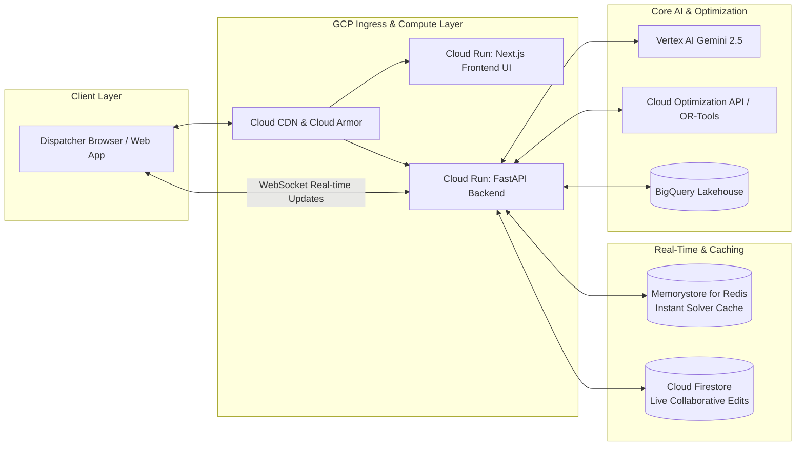

# End-to-End Autonomous Grocery Logistics: Multi-Temp Route Optimization & Dynamic Carrier Booking Engine (with Human-in-the-Loop UI)

## Executive Overview
This document specifies the technical architecture, multi-agent orchestration, mathematical modeling, GCP cloud services, and **Interactive Dispatcher UI with Human-in-the-Loop (HITL) Approval Workflows**.

The platform provides complete transparency, enabling dispatchers to visualize planned routes on interactive maps, adjust stop sequences via drag-and-drop, configure flexible trailer bulkheads, compare live carrier rates, and provide mandatory approvals before routes are committed, carriers are booked, and WMS warehouse picking waves are released.

---

## 1. Human-in-the-Loop (HITL) Workflow & Approval State Machine

To balance autonomous optimization with human domain expertise, the system operates on a **strict state machine** where AI suggests optimal plans, but critical execution gates require dispatcher sign-off.



---

## 2. Dispatcher Cockpit UI Architecture & Core Views

The frontend is a high-performance **React / Next.js SPA** hosted on **Cloud Run / Firebase Hosting**, communicating with the backend via REST and WebSockets for sub-second updates.

```mermaid
flowchart TD
    subgraph UI Presentation Components (React / Tailwind)
        V1[1. Interactive Map & Route Sequencer]
        V2[2. 2D/3D Trailer Bulkhead Visualizer]
        V3[3. Live Carrier Tender & Scorecard Board]
        V4[4. Strategic 2-Month Simulation & 3-Month BI Dashboard]
    end

    subgraph Real-Time Frontend State
        StateMgr[Zustand / TanStack Query State]
        V1 <--> StateMgr
        V2 <--> StateMgr
        V3 <--> StateMgr
        V4 <--> StateMgr
    end

    subgraph Backend API (FastAPI on Cloud Run)
        API_Routes[REST Endpoints: /routes, /carriers, /approve]
        WS_Validation[WebSocket: Real-Time Route Recalculation Engine]
        API_Analytics[BigQuery BI Analytics Connectors]
    end

    StateMgr <--> API_Routes
    StateMgr <--> WS_Validation
    StateMgr <--> API_Analytics
```

---

### Key UI Modules & Features

#### 1. Interactive Route Map & Stop Sequencer
- **Map Visualizer (Google Maps JavaScript API / Deck.gl)**:
  - Color-coded route lines representing each trailer (46W, 48W, 53W).
  - Stop pins showing customer names, arrival ETAs, delivery time windows, and temperature flags (❄️ Frozen, 🥦 Chill, 🥫 Ambient, 🧴 HMBC).
  - Visual alerts on soft-window violations ($> \pm 1$ hr) in yellow/red.
- **Drag-and-Drop Stop Editor**:
  - Dispatchers can drag customer stops between routes or reorder the stop sequence.
  - **Instant Recalculation Engine**: When a stop is moved, a lightweight background solver validates total cube capacity, axle weight, and recalculated ETAs within 300ms.

#### 2. Trailer Bulkhead & Pallet Load Visualizer
- **Interactive 2D Cross-Section**:
  - Top-down view of the 46W/48W/53W trailer floor showing 22 to 30 pallet positions.
  - Color-coded pallet blocks displaying customer ID and temperature class.
  - **Movable Bulkhead Slider**: Visualizes the insulated bulkhead divider location in 2-pallet increments.
  - **LIFO Sequence Validation**: Visually warns if an early-drop pallet is blocked behind late-drop pallets.

```
+-------------------------------------------------------------------------+
| [ NOSE: Frozen Zone (10 Pallets) ] | [ MID: Chill (6) ] | [ TAIL: Ambient (10) ] |
|  [P1: Cust A] [P2: Cust A]         |  [P11: Cust A]     |  [P17: Cust B]        |
|  [P3: Cust B] [P4: Cust B]         |  [P12: Cust B]     |  [P18: Cust B]        |
|  [P5: Cust C] [P6: Cust C]         |  [P13: Cust C]     |  [P19: Cust A]        |
|  <--- BULKHEAD 1 (Adjustable) ---> | <--- BULKHEAD 2 -> |  <--- REAR DOOR --->  |
+-------------------------------------------------------------------------+
```

#### 3. Live Carrier Tender & Multi-Criteria Scorecard Board
- **Ranked Carrier Comparison Cards**:
  - Displays all quoting carriers sorted by their **40/30/20/10 Score**.
  - Breakout metrics:
    - **Live Rate**: e.g., $1,450 vs market average $1,620 (+Score: 38/40).
    - **Reliability (3mo trailing)**: 97.4% On-Time Pickup (+Score: 29/30).
    - **SLA & Equipment Fit**: FSMA Certified Reefer, Pre-cool verified (+Score: 20/20).
    - **Relationship**: Tier-1 Preferred Carrier (+Score: 10/10).
  - **One-Click Override & Approval**: Dispatcher can select any qualified carrier and click **"Approve & Tender Booking"**.

#### 4. Historical Backtesting & 2-Month Forecast Dashboard
- **3-Month Historical Route Comparison**:
  - Side-by-side comparison of past actual routes vs AI-optimized routes (showing actual miles saved, cube fill rate improvement from 78% to 92%, and fuel savings).
- **2-Month Probabilistic Capacity Forecast**:
  - Heatmaps of projected weekly pallet volume by temperature zone.
  - Advance alerts for weeks where private fleet capacity will be exceeded, recommending early contracted reefer reservations.

---

## 3. End-to-End Multi-Agent Ecosystem (Updated with HITL)

```mermaid
flowchart TD
    subgraph Data Layer
        DB_Orders[(BigQuery: Orders & Forecast)]
        DB_Fleet[(BigQuery: Fleet & Docks)]
        DB_State[(Firestore: Live State)]
    end

    subgraph Multi-Agent Hub (Cloud Run & Vertex AI)
        A1[1. DC Sourcing & Demand Profiler Agent]
        A2[2. Cold-Chain Fleet Allocator Agent]
        A3[3. Cold-Chain Route Optimizer Agent]
        A4[4. Live Carrier Rate Aggregator Agent]
        A5[5. Carrier Scoring & Booking Agent]
        A6[6. Dynamic Cold-Chain Monitor Agent]
        A_HITL[Human-in-the-Loop Gateway Agent]
    end

    subgraph Dispatcher UI
        UI_Route[Route Approval & Bulkhead Editor View]
        UI_Carrier[Carrier Selection & Tender View]
    end

    DB_Orders --> A1 --> A3
    DB_Fleet --> A2 --> A3
    A3 <--> Solver[Cloud Optimization API / OR-Tools]
    A3 --> A_HITL
    A_HITL <--> UI_Route
    UI_Route -->|Approved Routes| A4
    A4 <--> CarrierAPIs[Carrier Freight APIs / EDI]
    A4 --> A5
    A5 --> A_HITL
    A_HITL <--> UI_Carrier
    UI_Carrier -->|Approved Booking| A5
    A5 --> CarrierAPIs
    A5 --> WMS[WMS Wave Release API]
    A6 <--> DB_State
```

---

## 4. GCP Technical Architecture for UI & Real-Time HITL



| Component | Purpose in HITL System |
| :--- | :--- |
| **Next.js & Tailwind CSS (Cloud Run)** | Responsive, low-latency UI for interactive route maps, stop editing, and carrier cards. |
| **FastAPI + WebSockets (Cloud Run)** | Provides real-time bidirectional communication for live stop drag-and-drop recalculations. |
| **Memorystore for Redis** | In-memory cache holding distance matrices and candidate route permutations for 300ms sub-second re-scoring. |
| **Cloud Firestore** | Supports multi-dispatcher collaboration (prevents two dispatchers from editing the same route simultaneously via optimistic locking). |
| **Firebase Authentication / Identity Platform** | Enterprise Single Sign-On (SSO) with Role-Based Access Control (Dispatcher vs Logistics Manager). |
| **BigQuery + Looker Embedded** | In-app embedded BI reporting for historical 3-month performance and 2-month demand curves. |

---

## 5. Summary of Dispatcher Controls & Permissions

1. **Route Modification Permissions**:
   - Move stop from Route A to Route B.
   - Change drop sequence on Route A.
   - Adjust trailer bulkhead position (reallocating Frozen vs Dry pallet ratios).
   - Change vehicle type (e.g., upgrade from 48W to 53W).
   - Split oversized order across two trailers.
2. **Carrier Selection Permissions**:
   - Accept AI-recommended top carrier (default).
   - Override with a secondary preferred carrier with manual rationale tag.
   - Trigger re-quote / spot refresh.
3. **Execution Gateways**:
   - **"Approve Routes" Button**: Unlocks route manifests for carrier tendering.
   - **"Approve & Tender Booking" Button**: Transmits EDI 204 / API booking and triggers WMS wave picking release.
