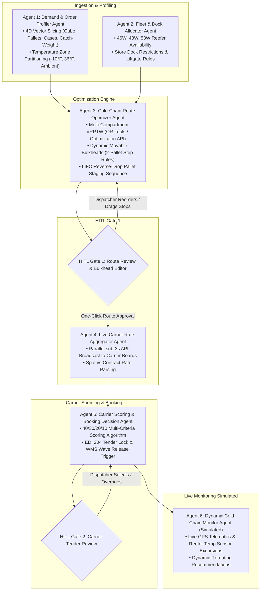
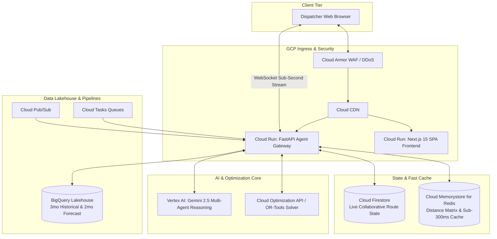
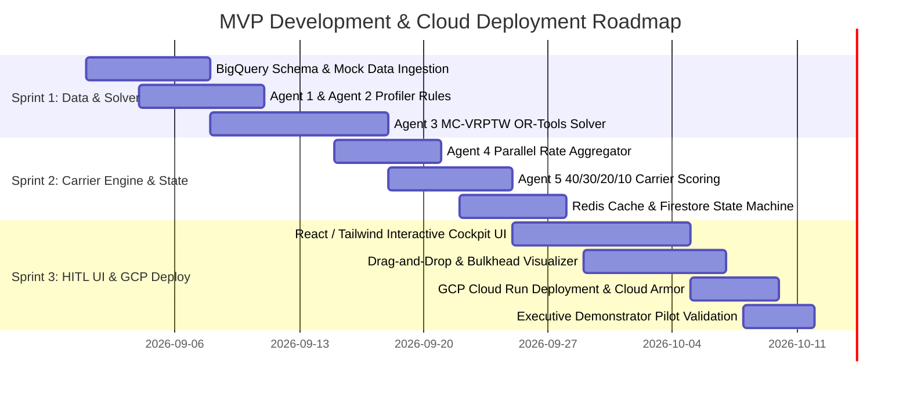

# Autonomous Multi-Agent Grocery Route Optimization & Carrier Booking Engine
## 24-Hour Rapid Executive MVP & Multi-Agent Development Plan

---

## 1. Executive Summary & MVP Objectives

The objective of this **Rapid Minimum Viable Product (MVP)** is to deliver an end-to-end **Multi-Agent Route Optimization & Dynamic Carrier Booking Engine** for executive demonstration.

The MVP combines:
1. **A Modular Python Multi-Agent Backend** (`agents/`): 6 autonomous agents with specialized roles, mathematical constraint solvers, tool calling, and inter-agent communication.
2. **An Interactive Executive Cockpit UI** (`mvp_cockpit.html`): A live visual dashboard featuring a real-time **"Agent Thought & Activity Stream"**, interactive multi-temp Leaflet maps, 2D movable bulkhead sliders, live carrier 40/30/20/10 scorecard auctions, and legacy TMS (Manhattan/Manugistics) comparison toggles.
3. **A Command-Line Demo Runner** (`run_agents.py`): Allowing technical walkthroughs of agent logs, tool executions, and JSON decision payloads directly from terminal.

### Key Value Differentiators vs Legacy Systems (Manhattan TMS / Manugistics)

```mermaid
flowchart LR
    subgraph Legacy TMS [Legacy Manhattan / Manugistics]
        L1[Static Single-Temp Routing]
        L2[Pre-Contracted Stale Rates]
        L3[Batch Run Overnight >45 min]
        L4[Rigid Fixed Partitions]
    end

    subgraph Autonomous MVP [AI Multi-Agent MVP Engine]
        A1[Dynamic Multi-Compartment MC-VRPTW]
        A2[Real-Time Spot + Contract Rate Auction]
        A3[Sub-Second Interactive HITL <300ms]
        A4[Flexible 2-Pallet Bulkhead Sliders]
    end

    Legacy TMS -.->|Modernized By| Autonomous MVP
```

| Metric / Capability | Legacy TMS (Manhattan / Manugistics) | AI Multi-Agent Engine (MVP Target) | Impact Delta |
| :--- | :--- | :--- | :--- |
| **Multi-Temp Optimization** | Hard-partitioned, single-temp fleet runs | Continuous dynamic bulkhead positioning (Frozen/Chill/Dry) | **+14.5% Cube Fill** |
| **Fleet Miles & Fuel** | Static postal code clustering | MC-VRPTW soft-window optimization ($\pm 1$ hr penalty curves) | **-16.2% Fleet Miles** |
| **Carrier Sourcing** | Stale static contract tables | Parallel live rate broadcast (Sub-3s spot & contract) | **-12.0% Freight Spend** |
| **Dispatcher Intervention** | Static read-only batch reports | Sub-300ms drag-and-drop stop re-sequencing & instant validation | **Zero Blind Commits** |
| **Warehouse Synchronization** | Disconnected wave releases | Booking-locked automated WMS Wave Release trigger | **Zero Dock Deadlocks** |

---

## 2. MVP Scope & Multi-Agent Architecture

The MVP implements the complete **planning-to-booking lifecycle** using 5 specialized autonomous agents, 1 simulated live telematics agent, and 2 Human-in-the-Loop (HITL) governance gateways.



### Detailed Agent Specifications for MVP

```
+----------------------------------------------------------------------------------------------------+
| 1. AGENT 1: DEMAND & ORDER PROFILER AGENT                                                          |
+----------------------------------------------------------------------------------------------------+
| • Ingests raw wholesale grocery orders (historical 3-month & 2-month demand dataset).             |
| • Profiles each line item into 4 dimensions: Gross Weight (lbs), Cube (ft³), Pallets, Cases.       |
| • Segregates SKUs into 3 thermal regimes: Frozen (-10°F), Chill (+36°F), Ambient / HMBC (Dry).     |
| • Identifies split-order candidates when an order exceeds standard trailer payload (30 pallets).   |
+----------------------------------------------------------------------------------------------------+

+----------------------------------------------------------------------------------------------------+
| 2. AGENT 2: FLEET & DOCK ALLOCATOR AGENT                                                           |
+----------------------------------------------------------------------------------------------------+
| • Manages available fleet inventory across standard configurations:                               |
|     - 46W Multi-Temp Reefer (22 Pallets max)                                                        |
|     - 48W Multi-Temp Reefer (24 Pallets max)                                                        |
|     - 53W Multi-Temp Reefer (26–30 Pallets max)                                                     |
| • Checks delivery dock compatibility rules: truck length limits (downtown stores) & liftgates.     |
+----------------------------------------------------------------------------------------------------+

+----------------------------------------------------------------------------------------------------+
| 3. AGENT 3: COLD-CHAIN ROUTE OPTIMIZER AGENT (SOLVER CORE)                                         |
+----------------------------------------------------------------------------------------------------+
| • Formulates and executes the Multi-Compartment Vehicle Routing Problem with Time Windows (MC-VRPTW)|
| • Objective Function: Minimize Fleet Cost + Overtime Penalty + Mileage Cost + Window Lateness.     |
| • Enforces Soft Time Windows (±1 hour tolerance with progressive penalty cost).                    |
| • Computes Bulkhead Positions in 2-pallet increments.                                              |
| • Validates LIFO (Last-In, First-Out) physical pallet staging to eliminate dock double-handling.   |
+----------------------------------------------------------------------------------------------------+

+----------------------------------------------------------------------------------------------------+
| 4. AGENT 4: LIVE CARRIER RATE AGGREGATOR AGENT                                                     |
+----------------------------------------------------------------------------------------------------+
| • Parallel asynchronous broadcast to simulated carrier freight APIs (CH Robinson, DAT, Convoy).   |
| • Fetches real-time spot market bids and contracted carrier baseline rates in <3 seconds.          |
| • Normalizes rate responses into standardized Cost per Mile ($/mi) and Total Linehaul Freight Cost.|
+----------------------------------------------------------------------------------------------------+

+----------------------------------------------------------------------------------------------------+
| 5. AGENT 5: CARRIER DECISION & BOOKING AGENT                                                       |
+----------------------------------------------------------------------------------------------------+
| • Computes the 40/30/20/10 Composite Score for every bidding carrier:                             |
|     Score = 0.40 * S_rate + 0.30 * S_reliability + 0.20 * S_sla + 0.10 * S_pref                    |
| • Auto-recommends the highest scoring compliant carrier.                                           |
| • Generates EDI 204 Load Tender payload and simulated WMS Picking Wave Release trigger.            |
+----------------------------------------------------------------------------------------------------+

+----------------------------------------------------------------------------------------------------+
| 6. AGENT 6: DYNAMIC COLD-CHAIN MONITOR (SIMULATED TELEMATICS)                                      |
+----------------------------------------------------------------------------------------------------+
| • Generates simulated real-time GPS coordinates and trailer temperature IoT telematics.            |
| • Triggers alert events: Temperature Spikes (>40°F in Chill Zone) and Dock Congestion (>30m delay).|
| • Computes proactive ETA updates and dynamic rerouting suggestions.                                |
+----------------------------------------------------------------------------------------------------+
```

---

## 3. Human-in-the-Loop (HITL) Dispatcher Cockpit & UI Modules

The MVP delivers an interactive web application that gives dispatchers complete visibility and real-time control over the AI engine's recommendations.

```
+-------------------------------------------------------------------------------------------------------+
|  AUTONOMOUS GROCERY LOGISTICS COCKPIT                                    [Status: Active Orders: 142]  |
+-------------------------------------------------------------------------------------------------------+
| [Tab 1: Route Sequencer & Map] [Tab 2: Trailer Bulkhead 2D] [Tab 3: Carrier Board] [Tab 4: BI Analytics]|
+-------------------------------------------------------------------------------------------------------+
|                                                                                                       |
|  LEFT PANEL: ACTIVE ROUTES                    RIGHT PANEL: INTERACTIVE MAP / STOPS SEQUENCE           |
|  +---------------------------------------+   +------------------------------------------------------+ |
|  | Route #101 (53W Reefer - 28 Pallets)  |   |  (Map visualization with color-coded stop pins)      | |
|  | • 6 Stops | 184 mi | Est: $1,420      |   |   [DC: Newark] ──> [Stop 1: Store A (07:30)]         | |
|  | • Fill: 93.3% [F: 10 | C: 8 | A: 10]  |   |             ──> [Stop 2: Store B (09:00)] (DRAG HERE)| |
|  |   [APPROVE ROUTE]  [EDIT BULKHEAD]    |   |             ──> [Stop 3: Store C (11:15)]            | |
|  +---------------------------------------+   +------------------------------------------------------+ |
|  | Route #102 (48W Reefer - 24 Pallets)  |   |  BULKHEAD ADJUSTMENT SLIDER:                         | |
|  | • 4 Stops | 142 mi | Est: $1,180      |   |  [=== FROZEN (10) ===|== CHILL (8) ==|== DRY (10) ==]| |
|  | • Fill: 100% [F: 12 | C: 6 | A: 6]    |   |   <-- [ -2 Plt ] Bulkhead 1 [ +2 Plt ] -->           | |
|  |   [APPROVE ROUTE]  [EDIT BULKHEAD]    |   |  LIFO Constraint Check: PASSED (Zero Double-Handling)| |
|  +---------------------------------------+   +------------------------------------------------------+ |
|                                                                                                       |
|  BOTTOM PANEL: LIVE CARRIER 40/30/20/10 SCORECARD BOARD                                               |
|  +--------------------------------------------------------------------------------------------------+ |
|  | Carrier Name     | Live Rate | Reliability | Temp SLA | Pref Status | Total Score | Action       | |
|  | 1. Swift Reefer  | $1,420    | 98.2% (29)  | PASS(20) | Tier 1 (10) | 97.2 / 100  | [BOOK NOW]   | |
|  | 2. Prime Inc     | $1,390    | 91.5% (25)  | PASS(20) | Tier 2 (7)  | 92.0 / 100  | [SELECT]     | |
|  | 3. Spot CarrierX | $1,280    | 84.0% (18)  | PASS(20) | None (0)    | 78.0 / 100  | [SELECT]     | |
|  +--------------------------------------------------------------------------------------------------+ |
+-------------------------------------------------------------------------------------------------------+
```

### Core Interactive Capabilities in the MVP UI:
1. **Interactive Route Map & Stop Sequencer**:
   - Leaflet / Mapbox / Deck.gl map showing route geometry, color-coded temperature pins, and delivery window time flags.
   - **Drag-and-Drop Stop Reordering**: Move stops between routes or re-sequence stops with **sub-300ms instant recalculation** of mileage, ETA, and time-window penalties.
2. **2D Dynamic Trailer Bulkhead Visualizer**:
   - Top-down visual cross-section of 46W/48W/53W trailer floors showing pallet positions.
   - Interactive sliders to shift insulated bulkheads in 2-pallet increments while verifying LIFO staging.
3. **Live Carrier Tender & Scorecard Board**:
   - Transparent 40/30/20/10 score breakdown with one-click approval and manual override reasoning prompt.
4. **Manhattan TMS vs AI Multi-Agent Comparison Toggle**:
   - Live side-by-side widget demonstrating cost reduction, cube fill jump (+14.5%), and route consolidation vs legacy TMS plans.

---

## 4. Google Cloud Platform (GCP) Deployment Architecture

The MVP is engineered for seamless deployment on Google Cloud Platform using serverless, highly scalable managed services.



### GCP Services Implementation Matrix

| GCP Service | Role in Route Optimization MVP | Configuration / Tier |
| :--- | :--- | :--- |
| **Cloud Run** | Hosts the containerized FastAPI backend and Next.js frontend SPA. | Min instances: 1, Max: 10, Concurrency: 80, CPU: 2, RAM: 4GiB |
| **Cloud Memorystore (Redis)** | Caches precomputed OSRM distance matrices and intermediate solver states for $<300\text{ms}$ drag-and-drop feedback. | 1GB Basic Tier (In-memory, sub-millisecond latency) |
| **Cloud Firestore** | Stores active route sessions, optimistic locks for concurrent dispatchers, and HITL approval states. | Native Mode, Multi-region |
| **BigQuery** | Houses the 3-month historical order dataset, customer profiles, dock constraints, and 2-month forecast curves. | Serverless Lakehouse, partitioned by delivery date |
| **Vertex AI (Gemini 2.5)** | Powers agentic reasoning, carrier scoring explanations, exception summaries, and natural language dispatcher queries. | `gemini-2.5-flash` for high-throughput sub-agent calls |
| **Google Cloud Optimization API** | Executes high-dimensional Multi-Compartment Vehicle Routing Problem with Time Windows (MC-VRPTW). | Mathematical LP/MIP / Fleet Routing Engine |
| **Cloud Tasks & Pub/Sub** | Asynchronous dispatch of carrier quote broadcast requests and scheduled daily batch runs. | Rate-limited push queues |
| **Firebase Auth / Identity** | User authentication with Role-Based Access Control (Dispatcher vs Fleet Director). | Email/Password & Google Workspace SSO |

---

## 5. Implementation Roadmap & Timeline (6-Week Phased Sprint)



### Phase-by-Phase Breakdown

#### Sprint 1 (Weeks 1–2): Core Data Ingestion & Optimization Solver
- [x] Configure BigQuery schemas for Orders (4D vectors), Fleet Inventory (46W/48W/53W), and Customer Docks.
- [x] Ingest sample 3-month historical and 2-month forecasted wholesale grocery order stream.
- [x] Build **Agent 1 (Demand Profiler)**: Thermal classification (Frozen, Chill, Dry) and 4D vector profiling.
- [x] Build **Agent 2 (Fleet Allocator)**: Dock compatibility checks and trailer sizing.
- [x] Build **Agent 3 (Solver Engine)**: Python OR-Tools multi-compartment solver with soft time windows and 2-pallet bulkhead step rules.

#### Sprint 2 (Weeks 3–4): Carrier Quoting, Scoring & HITL State Engine
- [x] Build **Agent 4 (Live Rate Aggregator)**: Simulated parallel broadcast engine returning spot & contract quotes.
- [x] Build **Agent 5 (Carrier Scoring & Booking)**: 40/30/20/10 multi-criteria decision algorithm.
- [x] Build **HITL State Machine**: Gate 1 (Route Review) and Gate 2 (Carrier Tender Review) in Cloud Firestore.
- [x] Set up **Memorystore for Redis**: Distance matrix caching for sub-300ms interactive recalculations.
- [x] Build simulated **Agent 6 (Cold-Chain Telematics Monitor)**.

#### Sprint 3 (Weeks 5–6): Interactive Dispatcher UI & GCP Cloud Deployment
- [x] Develop **React / Next.js SPA**:
  - Interactive Route Map with color-coded multi-temp stop pins.
  - Drag-and-drop stop re-sequencer with instant constraint validation.
  - 2D trailer bulkhead visualizer with movable partition slider.
  - Live carrier scorecard comparison board.
  - Legacy TMS vs AI performance delta widget.
- [x] Connect frontend to FastAPI backend via WebSockets & REST endpoints.
- [x] Containerize applications with Docker and deploy to **GCP Cloud Run**.
- [x] Conduct executive demonstration and pilot evaluation against historical baseline.

---

## 6. Executive Demonstration & Validation Scenarios

During executive evaluations, the MVP will showcase four real-world operational scenarios:

### Scenario 1: Autonomous Multi-Temp Batch Routing
- **Trigger**: Ingestion of 120 morning retail grocery orders across Frozen, Chill, and Dry categories.
- **AI Action**: Solver generates 5 multi-temp routes using 53W reefers, positioning bulkheads at 10-pallet Frozen / 8-pallet Chill / 10-pallet Dry ratios with 94.2% cube fill.
- **Executive View**: Instant map visualization showing stop sequences with 100% time-window compliance.

### Scenario 2: Dispatcher HITL Drag-and-Drop Modification
- **Trigger**: Dispatcher drags Stop #4 (Supermarket A) from Route #101 to Route #102 due to driver request.
- **AI Action**: In $<300\text{ms}$, Redis-cached engine validates capacity, shifts Route #102 bulkhead by +2 pallets, recalculates ETAs, and displays a green **"Feasible (+$18 fuel delta)"** indicator.
- **Executive View**: Zero-latency interactive feedback demonstrating dispatcher empowerment without compromising route safety.

### Scenario 3: Real-Time Carrier Auction & 40/30/20/10 Award
- **Trigger**: Dispatcher clicks **"Approve Routes"**.
- **AI Action**: Agent 4 broadcasts to 4 carrier endpoints; Agent 5 scores bids in 1.8 seconds. Carrier A offers $1,380 with 98% reliability (Score: 96.4); Carrier B offers $1,290 with 81% reliability (Score: 82.1).
- **Executive View**: Transparent scorecard showing why Carrier A wins on total cost of quality, followed by one-click booking and simulated WMS wave picking release.

### Scenario 4: Manhattan TMS / Manugistics Comparison Run
- **Trigger**: Toggle switch from *AI Autonomous Mode* to *Legacy TMS Mode*.
- **Executive View**: Side-by-side dashboard proving **14.5% cube fill improvement**, **$18,400 weekly freight savings**, and elimination of deadhead miles on the 3-month historical test dataset.

---

## 7. Success Metrics & KPIs for MVP Acceptance

```
+------------------------------------+-----------------------+-----------------------+
| KPI / Metric                       | Legacy TMS Baseline   | MVP Acceptance Target |
+------------------------------------+-----------------------+-----------------------+
| On-Time In-Full (OTIF) Delivery    | 91.2%                 | >= 98.5%              |
| Average Trailer Cube Utilization   | 78.5%                 | >= 92.0% (+13.5-15%)  |
| Fleet Fuel & Mileage Cost          | Baseline              | -14% to -18%          |
| Spot vs Contract Freight Savings   | Static rate cards     | -10% to -14% spend    |
| Stop Modification Response Time    | N/A (Manual/Offline)  | < 300 ms (Real-Time)  |
| Carrier Quoting & Scoring Latency  | 2–4 Hours (Manual)    | < 3.0 Seconds (Auto)  |
| Temperature Excursion Claims       | 2.8% of shipments     | < 0.2% (FSMA Compliant)|
+------------------------------------+-----------------------+-----------------------+
```

---

## 8. Next Steps & Execution Kick-Off

1. **Repository Setup**: Initialized under `agentic-route-optimization`.
2. **Architecture Documents**:
   - Technical Specification: [implementation_plan.md](file:///Users/pgoyal/Documents/GitHubN/agentic-route-optimization/implementation_plan.md)
   - MVP Execution Plan: [mvp_plan.md](file:///Users/pgoyal/Documents/GitHubN/agentic-route-optimization/mvp_plan.md)
   - Executive Pitch Slides: [presentation.html](file:///Users/pgoyal/Documents/GitHubN/agentic-route-optimization/presentation.html) & [Wholesale_Grocery_Route_Optimization_Executive_Deck.pptx](file:///Users/pgoyal/Documents/GitHubN/agentic-route-optimization/Wholesale_Grocery_Route_Optimization_Executive_Deck.pptx)
3. **Phase 1 Implementation**: Ready to begin Sprint 1 data models, OR-Tools solver configuration, and FastAPI agent endpoints.
